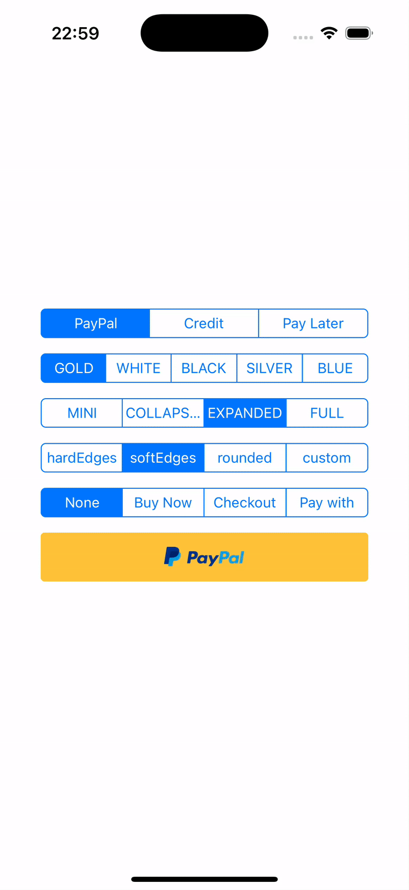

# react-native-paypal-buttons

React native implementation of PayPal Buttons
[Expo snack Demo](https://snack.expo.dev/@youedd/paypal-buttons)



## Table of Contents

- [Installation](#installation)
- [Setup](#setup)
- [Usage](#usage)
- [Props](#props)
  - [Common Props](#common-props)
  - [PayPalButton Specific Props](#paypalbutton-specific-props)
  - [PayPalPayLaterButton Specific Props](#paypalpaylaterbutton-specific-props)
  - [PayPalCreditButton Specific Props](#paypalcreditbutton-specific-props)
- [Contributing](#contributing)
- [License](#license)

## Installation

```sh
npm install react-native-paypal-buttons
```

## Setup

This package uses `PayPalOpen-Regular` for the button labels.

<details>
<summary>Bare React Native</summary>

#### iOS

Edit `Info.plist` and add a property called Fonts provided by application (or UIAppFonts if Xcode autocomplete is not working):
```
<key>UIAppFonts</key>
<array>
  <string>PayPalOpen-Regular.otf</string>
</array>
```

#### Android

Copy `node_modules/react-native-paypal-buttons/src/assets/fonts/PayPalOpen-Regular.otf` and paste it into `android/app/src/main/assets/fonts` (ensure the folder name is lowercase, i.e., fonts).

</details>

<details>
<summary>Expo</summary>

To use PayPal buttons with the correct font in an Expo project, follow these steps:

1. Install the `expo-font` package:
    ```sh
    expo install expo-font
    ```
2. Load the font in your app:
    ```tsx
    import { useFonts } from 'expo-font';
    import { PayPalButton } from 'react-native-paypal-buttons';

    const MyComponent = () => {
      const [fontsLoaded] = useFonts({
        'PayPalOpen-Regular': require('../node_modules/react-native-paypal-buttons/src/assets/fonts/PayPalOpen-Regular.otf'),
      });

      if (!fontsLoaded) {
        return null;
      }

      return <PayPalButton />;
    };
    ```

</details>

## Usage

```tsx
import { 
  PayPalButton,
  PayPalCreditButton,
  PayPalPayLaterButton,
} from 'react-native-paypal-buttons';

const MyComponent = () => (
  <>
    <PayPalButton />
    <PayPalPayLaterButton />
    <PayPalCreditButton />
  </>
);
```

## Props

### Common Props
Any [PressableProps](https://reactnative.dev/docs/pressable.html#props) and the following:
| Prop     | Values                                                                                   | Default Value |
|----------|------------------------------------------------------------------------------------------|---------------|
| `edges`  | `PaymentButtonEdges.HARD_EDGES`, `PaymentButtonEdges.SOFT_EDGES`, `PaymentButtonEdges.ROUNDED`, or a custom number | `PaymentButtonEdges.SOFT_EDGES` |
| `size`   | `PaymentButtonSize.MINI`, `PaymentButtonSize.COLLAPSED`, `PaymentButtonSize.EXPANDED`, `PaymentButtonSize.FULL` | `PaymentButtonSize.EXPANDED` |

### PayPalButton Specific Props

| Prop   | Values                                      | Default Value |
|--------|---------------------------------------------|---------------|
| `color`| `PayPalButtonColor.GOLD`, `PayPalButtonColor.WHITE`, `PayPalButtonColor.BLACK`, `PayPalButtonColor.SILVER`, `PayPalButtonColor.BLUE` | `PayPalButtonColor.GOLD` |
| `label`| `PayPalButtonLabel.NONE`, `PayPalButtonLabel.CHECKOUT`, `PayPalButtonLabel.BUY_NOW`, `PayPalButtonLabel.PAY_WITH` | `PayPalButtonLabel.NONE` |

### PayPalPayLaterButton Specific Props

| Prop   | Values                                      | Default Value |
|--------|---------------------------------------------|---------------|
| `color`| `PayLaterButtonColor.GOLD`, `PayLaterButtonColor.WHITE`, `PayLaterButtonColor.BLACK`, `PayLaterButtonColor.SILVER`, `PayLaterButtonColor.BLUE` | `PayLaterButtonColor.GOLD` |

### PayPalCreditButton Specific Props

| Prop   | Values                                      | Default Value |
|--------|---------------------------------------------|---------------|
| `color`| `CreditButtonColor.WHITE`, `CreditButtonColor.BLACK`, `CreditButtonColor.DARK_BLUE` | `CreditButtonColor.WHITE` |

## Contributing

See the contributing guide to learn how to contribute to the repository and the development workflow.

## License

MIT

---

Made with [create-react-native-library](https://github.com/callstack/react-native-builder-bob)
